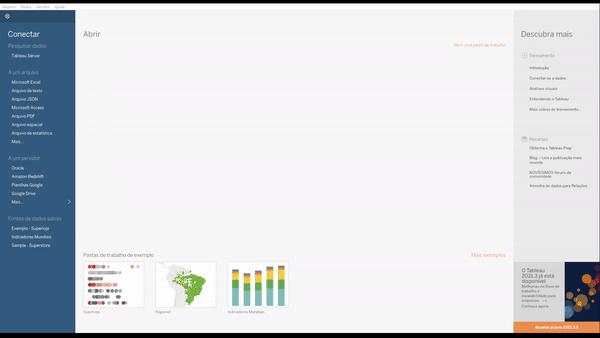

*Caso tenha perdido a parte 1, recomendamos que você dê uma olhadinha lá: [Parte 1](../parte1)*

Nessa segunda parte do guia de uso do Tableau vamos falar sobre configurações básicas de uso da ferramenta. Iniciamos a parte 1 falando sobre o que faz uma ferramenta de BI e o Tableau, agora vamos avançar para colocar um pouco mais a mão na massa!

# Criar sua Conta

Siga para o site do [Tableau](https://www.tableau.com/), e continue os passos abaixo:

<ol>
  <li>
    <b>Clique no botão Try Now ou <a href="https://www.tableau.com/products/trial">Try Tableau for Free</a></b> 
    </img>
  </li>
  <li>
    <b>Preencha o formulário de cadastro, após isso você receberá um e-mail com os próximos passos</b>
  </li>
  <li>
    <b>Siga os passos do Email</b>
  </li>
  <li>
    <b>Preencha as informações posteriores</b>
  </li>
  <li>
    <b>Faça o Download do <a href="https://www.tableau.com/support/releases">tableau desktop</a></b> 
    </img>
  </li>
  <li>
    <b>Faça o login no Tableau Desktop para começar a usar-lo</b>
  </li>
</ol>

# Configurações Iniciais

Agora que já baixamos o Tableau, vamos seguir para configurar uma fonte de dados! Para esse guia usaremos a [base](https://github.com/lautocargo7676/lauto-public-wikis/blob/master/base_teste.xlsx) presente nesse repositório. Existem duas formas de conectar a ela, a primeira é baixando o arquivo de forma local e a segunda é por via de um google drive (google sheets). Os processos serão similares, mas para conexão no sheets precisa upar o arquivo em um drive pessoal.

<ol>
  <li>Faça o download da <a href="https://github.com/lautocargo7676/lauto-public-wikis/blob/master/base_teste.xlsx"> Planilha </a></li>
  <li>
    Após fazer o download, clique no canto esquerdo em <b>Conectar > De um Arquivo </b> e selecione o arquivo baixado 
    </img>
  </li>
</ol>

O Tableau possui três tipos de estruturas básicas para construção de um Dash, planilhas, painéis e histórias:
- **[Planilhas](https://help.tableau.com/current/pro/desktop/pt-br/buildmanual_dragging.htm)** são o local onde são construídos os gráficos, legendas e filtros. Lá também é possível criar campos calculados a partir das colunas existentes na base de dados.
- **[Painéis](https://help.tableau.com/current/pro/desktop/pt-br/dashboards.htm)** são um agrupado de planilhas, e demais informações em uma visão single page report. Uma pasta pode ter vários painéis, mas cada painél pode ter diversas planilhas estruturadas junto a textos e imagens.
- **[Histórias](https://help.tableau.com/current/pro/desktop/pt-br/stories.htm)** são estruturas que agrupam planilhas de forma sequencial com intuito de construir uma história com a exibição dos dados.

Essas estruturas são mais detalhadas no [site da plataforma](https://help.tableau.com/current/pro/desktop/pt-br/building_overview.htm)

# Ajustando tipos de dados

Nessa base de dados que estamos utilizando, o campo Date está como String(Cadeia de caracteres) mas deveria estar como Datetime(Data e Hora). Por isso vamos convertê-lo.

</img>
1. Clique com botão direito em cima do campo
1. Selecione, "Alterar tipo de dados" > "Data e Hora"

Na nossa base só temos esse campo do tipo data e hora para convertermos, esse procedimento pode ser feito quantas vezes necessário para cada campo que necessite de conversão.
