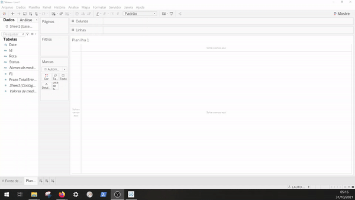
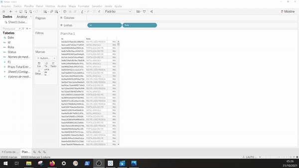
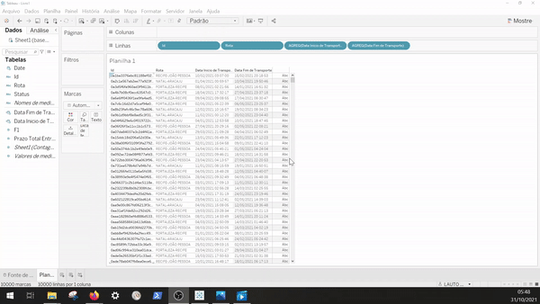
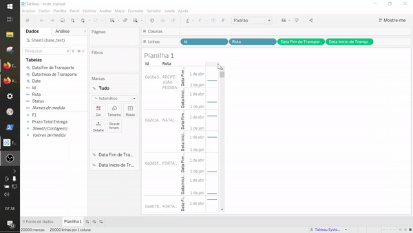
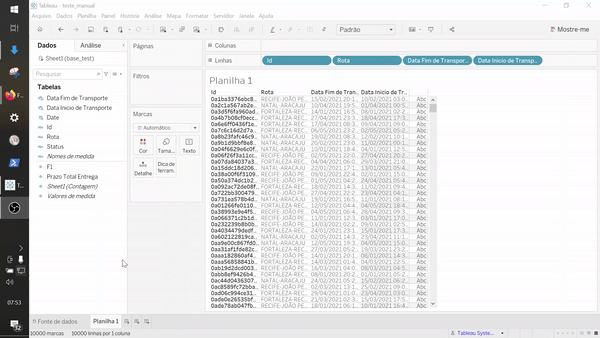
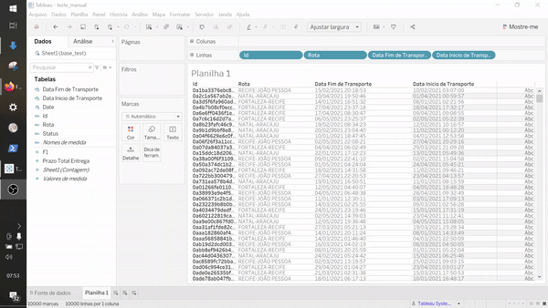

*Caso tenha perdido a parte 1 ou a parte 2, recomendamos que você dê uma olhadinha lá: [Parte 1](../parte1) e [Parte 2](../parte2)*

Nas últimas duas partes mostramos o que é BI e Tableau, e quais são as configurações iniciais. Vamos agora explicar um pouco sobre a fonte de dados e colocar a mão na massa e construir um Dash.

# Sobre a fonte de dados

***Obs:** Essa fonte de dados é artificial, não condizem com nosso processo operacional*

No processo de transporte de cargas, é importante fornecemos aos nossos clientes informações sobre o status das cargas. Para essa base em específico, são contemplados os 6 status listados abaixo:

- Solicitação do transporte
- Produto Recebido
- Documento Gerado
- Em Transporte de {cidade_origem} para {cidade_destino}
- Saiu para Entrega
- Produto Entregue

Na tabela, cada linha possui a informação de ID do pedido, a data e hora da ocorrência, status, rota e prazo. Uma das métricas para avaliar esse processo é através da análise dos tempos. Abaixo são apresentados os prazos para cada rota.

| Rota               | Prazo         |
| ------------------ |:-------------:|
| NATAL-ARACAJU      |       8       |
| FORTALEZA-RECIFE   |       5       |
| RECIFE-JOÃO PESSOA |       3       |


# Visões

Nesse guia inicial, vamos criar uma visão simples e comparativa do prazo esperado com o prazo realizado. Esse indicador é importante para operação logística acompanhar sua convergência ao tempo estipulado de entrega e repassado ao cliente. É importante ressaltar que a entrega antes do prazo embora seja menos prejudicial, também representa uma inadequação na entrega. Principalmente no caso do B2B, em que os clientes normalmente buscam evitar estoques desnecessários.

Esse indicador pode nos ajudar a melhorar o processo e compreender melhor os erros ocorridos em nossa operação durante um período. Por isso vamos criar duas planilhas:
- Gráfico comparativo entre Acordado X Realizado (Separado por rota, mês, ano)
- Detalhamento de entregas

Além disso, o gráfico comparativo servirá como filtro para o segundo gráfico.


#  Detalhamento de entregas
Embora seja a segunda planilha no painél que iremos criar, o detalhamento de entregas é mais simples de ser criado por isso vamos começar por ele. O Tableau funciona muito bem com o Drag and Drop, então essa visão será apenas uma tabela com o ID do Pedido, Rota, Inicio da Rota e Fim da Rota.

<ol>
  <li>Puxe para a área de Linhas na parte superior da planilha o campo Id</li>
  <li>
    Puxe para a área de Linhas na parte superior da planilha o campo Rota<br>
    <div align="center">
      </img>
    </div>
  </li>
  <li>
    Agora vamos criar um campo calculado para calcular a data de início e fim da viagem. A viagem deve começar na data mínima de status por ID e finalizar na data máxima de status por ID. Para isso, vamos usar o campo calculado para gerar essa informação. Para criar um campo basta clicar com botão direito do mouse no campo esquerdo na área "Tabelas" e selecionar a opção "Criar campo calculado". Em seguida, utilizar a fórmula MIN para data de início, e MAX para data de fim do transporte.
    <ul>
      <li>
        Crie o campo para Data Inicial<br>
        <div align="center">
          </img>
        </div>
      </li>
      <li>
        Crie o campo para Data Final<br>
        <div align="center">
          </img>
        </div>
      </li>
    </ul>
  </li>
  <li>
    Puxe para a área de Linhas na parte superior da planilha os novos campos criados
  </li>
</ol>

## Problema nessa forma de cálculo

Ao calcular o início e fim de viagem dessa forma, o Tableau utiliza o mínimo e máximo da exibição. Então vamos fazer um teste para explicar um pouco melhor isso. Adicione o campo Status após o campo de Rota.

<div align="center">
  </img>
</div>

Agora a data de início e fim não correspondem mais a data de início e fim do transporte. Isso porque alteramos a **granularidade** dos dados que estamos analisando, ao invés de usar o ID como registro mais único, estamos usando agora o Status (Existem varios Status dentro do ID, isso leva a mudar o cálculo).

A granularidade de uma base de dados é dada pela coluna que tem maior unicidade ou seja que define para uma linha a identidade de que ela não é repetida. Antes de colocarmos o campo de Status, essa unicidade era tida pelo campo de ID pois só exista uma linha por Id. Com a adição do campo de Status, agora só existe uma linha para a combinação de Id, Status alterando assim os valores do campo calculado. Como a base completa só tem uma combinação dessa também, o mínimo e máximo são iguais para cada linha.

Por isso, vamos alterar a fórmula dentro do campo calculado para:

- **Data Inicio do Transporte**
```Tableau
{FIXED [Id]: MIN(Date)}
```
- **Data Fim do Transporte**
```Tableau
{FIXED [Id]: MAX(Date)}
```

O Operador FIXED, garante que as funções usem como granularidade o valor passado. Nesse caso, a data inicio de transporte será calculado usando como base o Id e não a granularidade da linha. Ao fazer isso e recolocar as datas na planilha, aparecerá a mesma data de início para todos os status. O mesmo ocorrerá com a data de fim.

Agora, vamos recolocar os campos na planilha e retirar o campo de status.

## Caso o campo date fique como gráfico
O campo Date pode ficar como gráfico e tornar a visão um pouco bagunçada. Para isso é necessário converter ele de contínuo para discreto, o processo é simples, basta clicar no campo com o botão direito do mouse e marcar a opção discreto.
<div align="center">
  </img>
</div>

O último passo nessa planilha é ajustar a largura da página e renomear o título do gráfico.

- **Ajustar a largura** : Ir no canto superior do Tableau e selecionar a opção ajustar a largura

<div align="center">
  </img>
</div>

- **Renomear o título do gráfico** : Clicar duas vezes no título do gráfico e inserir o nome desejado

<div align="center">
  </img>
</div>
