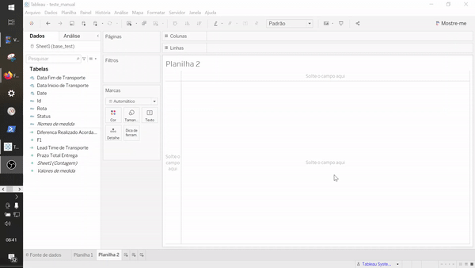
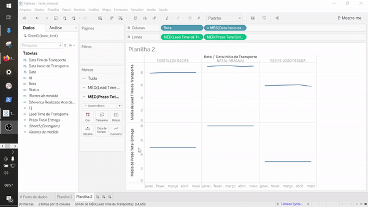
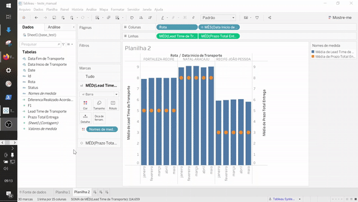
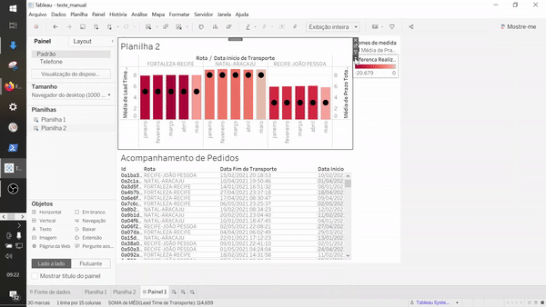

*Caso tenha perdido a parte 1, a parte 2 ou a parte 3, recomendamos que você dê uma olhadinha lá: [Parte 1](../parte1), [Parte 2](../parte2) e [Parte 3](../parte3)*

Nas últimas partes conseguimos evoluir na nossa primeira visão, agora vamos para segunda e posteriomente criar o painél.

# Gráfico comparativo

Agora que finalizamos a primeira visão, vamos partir para a segunda. Nessa vamos fazer um gráfico em barras com as informações aglutinadas dividindo por rota e período. Essa divisão é importante para termos uma visão de tempo médio por rota e comparar esse tempo médio com o tempo esperado.

Vamos criar uma nova planilha, e criar um novo campo calculado. Esse campo será a diferença entre a data de início do transporte e a data fim do transporte

**Lead Time de Transporte**
```Tableau
[Data Fim de Transporte] - [Data Inicio de Transporte]
```

Além disso, vamos também calcular o campo diferença entre o acordado e o realizado.


**Diferenca Realizado Acordado**
```Tableau
[Prazo Total Entrega] - [Lead Time de Transporte]
```

Esse último campo, representa a diferença entre o que era esperado e o que foi realizado. Sendo positivo caso a entrega tenha sido realizada dentro do prazo, e negativo se a entrega foi realizada fora do prazo. Buscando simplificar, consideraremos que quando for positivo a entrega foi conforme embora já tenhamos abordado a necessidade de entrega no prazo.

Agora vamos puxar o campo LeadTime e Prazo Total para as linhas, e Rota e Data Inicio para as colunas.

<div align="center">
  </img>
</div>

O campo Data Inicio vai se aglutinar em Ano, então é só clicar no "+" a esquerda do nome e separar até chegar em mês. Outro ponto são os campos de linha estarem como soma, quando na verdade deveriam estar como média. Para ajustar isso, basta clicar com o botão direito em cima do campo e alterar a Medida de soma para média.

Um ponto importante para ajudar na visualização das informações é o que estamos disponibilizando. No caso, a análise leva em consideração o período mensal, por isso acreditamos que seria mais fácil de compreender se o gráfico estivesse no formato de barras. Além disso, se fosse possível comparar os dois gráficos em uma mesma visão.

Para isso, vamos realizar três ações, a primeira transformar o gráfico de linha em barras, e a segunda é criar um eixo duplo e por fim transformar o gráfico com o prazo em uma marcação.

- **Linhas para Barras** : Para transformar o gráfico de linhas em barras, é preciso ir na margem direita do Tableau, no campo marcas e selecionar no dropdown o gráfico de barras.
<div align="center">
  </img>
</div>

- **Eixo Duplo** : Para criar o eixo duplo, basta ir nas medidas de linha e clicar com o botão direito e selecionar o opção eixo duplo. Posteriormente é necessário apenas sincronizar os eixos. Para isso, basta clicar no eixo com o botão direito e selecionar a opção de sincronizar os eixos.
<div align="center">
   </img>
</div>

- **Transformar gráfico em marcação** : Para fazer a transformação do gráfico em marcação o fluxo é similar ao da transformação no gráfico de barras, porém dessa vez vamos selecionar apenas na seção de Marcas a medida desejada (MED(Prazo Total Entrega)).


Agora estamos quase com a visão finalizada, falta apenas tornar o gráfico colorido a medida que a diferença entre o esperado e realizado se distancia. Para adicionar as cores, basta selecionar em Marcas o gráfico de LeadTime e arrastar até a opção "Cor" a medida "Diferenca Realizado Acordado". Para alterar as cores basta clicar na legenda criada no canto direito da tela.

<div align="center">
   </img>
</div>

Por fim, vamos renomear o gráfico e partimos para construção do painel.

# Criando Painel

Para construir o painel é bem simples, vamos apenas selecionar as planilhas e posteriormente tornar um gráfico filtro do outro.

- **Selecionar as Planilhas** : A seleção de planilhas é feita arrastando a planilha para o painel.

<div align="center">
   </img>
</div>

- **Ajustar as planilhas**

<div align="center">
   </img>
</div>

- **Tornar uma planilha filtro** : Para tornar uma planilha filtro, basta selecionar no canto da planilha a opção de "tornar essa planilha filtro"

<div align="center">
   </img>
</div>

Finalizamos assim a última parte desse guia inicial sobre o Tableau!
